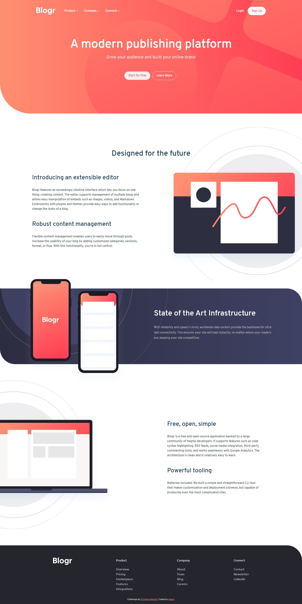

# Frontend Mentor - Blogr landing page solution

This is a solution to the [Blogr landing page challenge on Frontend Mentor](https://www.frontendmentor.io/challenges/blogr-landing-page-EX2RLAApP). Frontend Mentor challenges help you improve your coding skills by building realistic projects.

## Table of contents

- [Overview](#overview)
  - [The challenge](#the-challenge)
  - [Screenshot](#screenshot)
  - [Links](#links)
- [My process](#my-process)
  - [Built with](#built-with)
  - [What I learned](#what-i-learned)
  - [Continued development](#continued-development)
  - [Useful resources](#useful-resources)
- [Author](#author)
- [Acknowledgments](#acknowledgments)

## Overview

### The challenge

Users should be able to:

- View the optimal layout for the site depending on their device's screen size
- See hover states for all interactive elements on the page

### Screenshot

### Links

- Solution URL: [Solution URL](https://www.frontendmentor.io/solutions/mobilefirst-workflow-blogr-landing-page-Xg86dkNDH)
- Live Site URL: [Live site](https://zulfaabam.github.io/blogr-frontendmentor/)

## My process

### Built with

- Semantic HTML5 markup
- CSS custom properties
- Flexbox
- Mobile-first workflow

### What I learned

I learned how to make a dropdown navigation bar on this challenge. I also learned how to make a responsive mobile and desktop navbar with some animation added to it.

### Continued development

### Useful resources

## Author

- Website - [Abam's Website](https://zulfaabam.github.io/my-portfolio-website/)
- Frontend Mentor - [@Zulfaabam](https://www.frontendmentor.io/profile/Zulfaabam)
- Twitter - [@zabamz1](https://www.twitter.com/zabamz1)

## Acknowledgments
